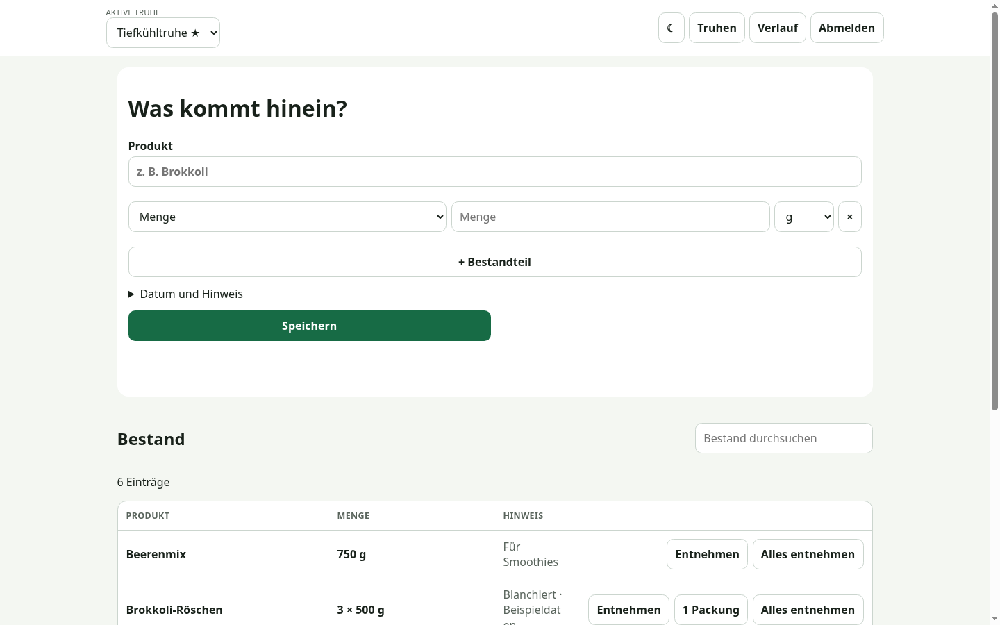
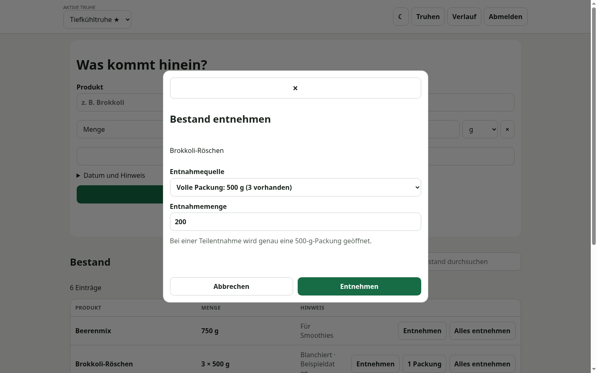
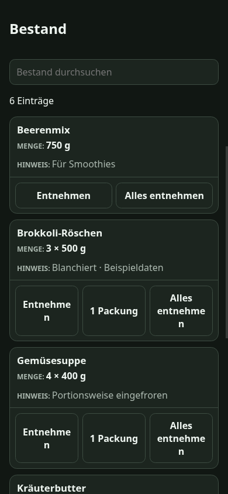

# Vorratsliste

[Deutsche Fassung](#deutsch) · [Englische Fassung](#english)

## Screenshots

Desktop-Bestand / Desktop inventory:



Entnahme einer Teilmenge aus einer Packung / Withdrawing a partial quantity from a package:



Mobile Bestandsansicht im Dark Mode / Mobile inventory in dark mode:



## Deutsch

Eine kleine, lokal betriebene Flask-/SQLite-Anwendung für mehrere Lagerorte, etwa Tiefkühltruhe, Vorratsschrank oder Keller. Sie unterstützt strukturierte Packungs- und Restmengen, clientseitige Suche, Archiv, Änderungsverlauf und ein mobiles Light-/Dark-UI. Das optionale Datum „Eingelagert am“ kann bei Tiefkühlware weiterhin als Einfrierdatum verwendet werden.

> **Hinweis:** Die Anwendung selbst ist derzeit ausschließlich auf Deutsch verfügbar. Eine mehrsprachige Benutzeroberfläche ist für dieses Sideprojekt aktuell nicht geplant.

### Installation mit uv

Voraussetzungen: Python 3.11+, `uv`; für die JavaScript-Modultests Node 20+.

```sh
uv sync --extra dev
cp config/config.example.yaml config/config.yaml
uv run tiefkuehlliste-password 'ein-langes-passwort'
```

Den ausgegebenen Hash (nicht das Passwort) in `config/config.yaml` eintragen. Dort können außerdem Bind-Adresse und Port gesetzt werden:

```yaml
server:
  host: 127.0.0.1
  port: 5050
```

Danach einen zufälligen Sitzungsschlüssel setzen, Datenbank initialisieren und starten:

```sh
export SECRET_KEY="$(python -c 'import secrets; print(secrets.token_hex(32))')"
uv run flask --app tiefkuehlliste:create_app init-db
uv run tiefkuehlliste
```

Die URL folgt `server.host` und `server.port`. `tiefkuehlliste --port 8080` beziehungsweise `--host` überschreiben die YAML-Werte; `PORT` und `HOST` sind nachrangige Umgebungsvariablen. Mit `--config PFAD` oder `TIEFKUEHLLISTE_CONFIG` lässt sich eine andere Konfigurationsdatei wählen. Beim ersten Start wird `instance/inventory.sqlite` inklusive „Lagerort 1“ angelegt. Über „Lagerorte“ kann dieser umbenannt und können weitere Orte angelegt werden. Bei bestehenden Datenbanken bleiben alle Namen und Bestände unverändert. `DATABASE` setzt einen alternativen Datenbankpfad; für einen HTTPS-Reverse-Proxy aktiviert `COOKIE_SECURE=1` sichere Cookies.

Hinweis: Die Datenbank wird beim App-Start automatisch auf das aktuelle nummerierte Schema gebracht. Das zusätzliche `init-db`-Kommando ist idempotent und dient der expliziten Betriebsprüfung.

### Container mit Podman

Das Image lauscht standardmäßig auf `0.0.0.0:2480` und läuft als nicht
privilegierter Benutzer. Im Container werden diese Pfade verwendet:

- `/config/config.yaml`: YAML-Konfiguration, nur lesend einbinden
- `/data/inventory.sqlite`: SQLite-Datenbank; das gesamte Verzeichnis `/data`
  beschreibbar und persistent einbinden

Für eine direkt auf dem Host sichtbare Datenbank das lokale, von Git ignorierte
Verzeichnis `instance/` verwenden:

```sh
podman build -t tiefkuehlliste .
mkdir -p instance
podman run --rm -p 2480:2480 \
  -v ./instance:/data:Z,U \
  -v ./config/config.yaml:/config/config.yaml:ro,Z \
  -e SECRET_KEY='einen-langen-zufaelligen-wert-eintragen' \
  tiefkuehlliste
```

Damit liegt die Datenbank dauerhaft unter `./instance/inventory.sqlite`. Die
Podman-Option `U` passt den Eigentümer des Host-Verzeichnisses an den
Container-Benutzer an und kann dessen Eigentümer auf dem Host verändern. `Z`
setzt bei aktiviertem SELinux das passende private Label. Das gesamte Verzeichnis
wird eingebunden, damit SQLite auch Journaldateien daneben anlegen kann.

Alternativ hält ein benanntes Podman-Volume die Daten außerhalb des
Projektverzeichnisses:

```sh
podman volume create tiefkuehlliste-data
podman run --rm -p 2480:2480 \
  -v tiefkuehlliste-data:/data:U \
  -v ./config/config.yaml:/config/config.yaml:ro,Z \
  -e SECRET_KEY='einen-langen-zufaelligen-wert-eintragen' \
  tiefkuehlliste
```

Vor dem Start `config/config.yaml` wie oben beschrieben anlegen und einen echten
Passwort-Hash eintragen. Die Konfiguration bleibt durch `ro` schreibgeschützt;
`SECRET_KEY` wird separat als Umgebungsvariable übergeben. Ohne expliziten
`/data`-Mount erzeugt Podman wegen der `VOLUME`-Anweisung ein anonymes Volume,
das sich für gezielte Backups und Restores schlechter zuordnen lässt.

Ein anderer Host-Port kann links in der Portzuordnung gewählt werden,
beispielsweise `-p 8080:2480`. Um auch den Port im Container zu ändern,
zusätzlich `-e PORT=8080` und `-p 8080:8080` setzen.

### Virtuelle Umgebung mit `uv venv`

```sh
uv venv
. .venv/bin/activate
uv pip install -e '.[dev]'
cp config/config.example.yaml config/config.yaml
tiefkuehlliste-password 'ein-langes-passwort'
tiefkuehlliste
```

Für einen direkten lokalen Test kann alternativ die mitgelieferte, von Git ignorierte
`config/config.yaml` verwendet werden. Sie nutzt Port `5050`; die Zugangsdaten stehen als Kommentar in der Datei.

### Prüfen

```sh
uv run ruff format --check .
uv run ruff check .
uv run pytest
npm test
```

### Backup und Restore

Während des Backups keine Änderungen ausführen. Ein konsistentes Online-Backup gelingt mit `sqlite3 instance/inventory.sqlite ".backup backup.sqlite"`; alternativ die Anwendung stoppen und die Datei kopieren. Zum Restore Anwendung stoppen, die defekte Datenbank sicher verwahren, die Backup-Datei an den in `DATABASE` konfigurierten Pfad kopieren und neu starten. `config/config.yaml` und `SECRET_KEY` separat sichern.

Details zu Mengen-, API- und Sicherheitsentscheidungen stehen in [docs/architecture.md](docs/architecture.md). Es gibt bewusst keine Rollen, Cloud-Synchronisation, Barcodes oder Warenwirtschaftsfunktionen.
Das konkrete mobile/desktop Prüfergebnis und die Interaktionszählung stehen in [docs/verification.md](docs/verification.md).

### Lizenz

Dieses Projekt steht unter der [Do What The Fuck You Want To Public License, Version 2](LICENSE) (WTFPL-2.0).


## English

A small, self-hosted Flask/SQLite application for managing multiple storage locations, such as a freezer, pantry cupboard, or cellar. It supports structured package and remainder quantities, client-side search, an archive, a change history, and a mobile-friendly light/dark UI. The optional “stored on” date can still be used as a freezing date for frozen food.

> **Note:** The application itself is currently available in German only. A multilingual UI is not currently planned for this side project.

### Installation with uv

Requirements: Python 3.11+ and `uv`; Node 20+ is required for the JavaScript module tests.

```sh
uv sync --extra dev
cp config/config.example.yaml config/config.yaml
uv run tiefkuehlliste-password 'a-long-password'
```

Add the generated hash (not the password) to `config/config.yaml`. You can also configure the bind address and port there:

```yaml
server:
  host: 127.0.0.1
  port: 5050
```

Then set a random session secret, initialize the database, and start the application:

```sh
export SECRET_KEY="$(python -c 'import secrets; print(secrets.token_hex(32))')"
uv run flask --app tiefkuehlliste:create_app init-db
uv run tiefkuehlliste
```

The URL follows `server.host` and `server.port`. `tiefkuehlliste --port 8080` and `--host` override the YAML values; the `PORT` and `HOST` environment variables have lower precedence. Use `--config PATH` or `TIEFKUEHLLISTE_CONFIG` to select a different configuration file. On first launch, `instance/inventory.sqlite` is created along with a default location named “Lagerort 1”. The “Lagerorte” menu lets you rename it and add more locations. Existing databases keep all location names and inventory unchanged. `DATABASE` selects an alternative database path; set `COOKIE_SECURE=1` to enable secure cookies behind an HTTPS reverse proxy.

Note: The database is automatically migrated to the latest numbered schema when the application starts. The additional `init-db` command is idempotent and serves as an explicit operational check.

### Container with Podman

By default, the image listens on `0.0.0.0:2480` and runs as an unprivileged user. It uses these paths inside the container:

- `/config/config.yaml`: YAML configuration, mounted read-only
- `/data/inventory.sqlite`: SQLite database; mount the entire `/data` directory as writable and persistent

To keep the database directly accessible on the host, use the local, Git-ignored `instance/` directory:

```sh
podman build -t tiefkuehlliste .
mkdir -p instance
podman run --rm -p 2480:2480 \
  -v ./instance:/data:Z,U \
  -v ./config/config.yaml:/config/config.yaml:ro,Z \
  -e SECRET_KEY='insert-a-long-random-value' \
  tiefkuehlliste
```

The database is then persisted at `./instance/inventory.sqlite`. The Podman option `U` adjusts ownership of the host directory for the container user and may change its owner on the host. With SELinux enabled, `Z` applies the appropriate private label. The entire directory is mounted so SQLite can create journal files alongside the database.

Alternatively, a named Podman volume keeps the data outside the project directory:

```sh
podman volume create tiefkuehlliste-data
podman run --rm -p 2480:2480 \
  -v tiefkuehlliste-data:/data:U \
  -v ./config/config.yaml:/config/config.yaml:ro,Z \
  -e SECRET_KEY='insert-a-long-random-value' \
  tiefkuehlliste
```

Before starting, create `config/config.yaml` as described above and add a real password hash. The `ro` option keeps the configuration read-only; `SECRET_KEY` is passed separately as an environment variable. Without an explicit `/data` mount, Podman creates an anonymous volume because of the `VOLUME` instruction, making targeted backups and restores harder to manage.

Choose a different host port on the left side of the port mapping, for example `-p 8080:2480`. To change the port inside the container as well, additionally set `-e PORT=8080` and `-p 8080:8080`.

### Virtual environment with `uv venv`

```sh
uv venv
. .venv/bin/activate
uv pip install -e '.[dev]'
cp config/config.example.yaml config/config.yaml
tiefkuehlliste-password 'a-long-password'
tiefkuehlliste
```

For a direct local test, you can instead use the included, Git-ignored `config/config.yaml`. It uses port `5050`; the credentials are included as a comment in the file.

### Checks

```sh
uv run ruff format --check .
uv run ruff check .
uv run pytest
npm test
```

### Backup and restore

Do not modify data while creating a backup. For a consistent online backup, run `sqlite3 instance/inventory.sqlite ".backup backup.sqlite"`; alternatively, stop the application and copy the file. To restore, stop the application, preserve the damaged database in a safe location, copy the backup to the path configured in `DATABASE`, and restart. Back up `config/config.yaml` and `SECRET_KEY` separately.

Quantity, API, and security decisions are documented in [docs/architecture.md](docs/architecture.md). Roles, cloud synchronization, barcodes, and inventory-management features are deliberately out of scope. The specific mobile/desktop test results and interaction counts are recorded in [docs/verification.md](docs/verification.md).

### License

This project is licensed under the [Do What The Fuck You Want To Public License, Version 2](LICENSE) (WTFPL-2.0).
